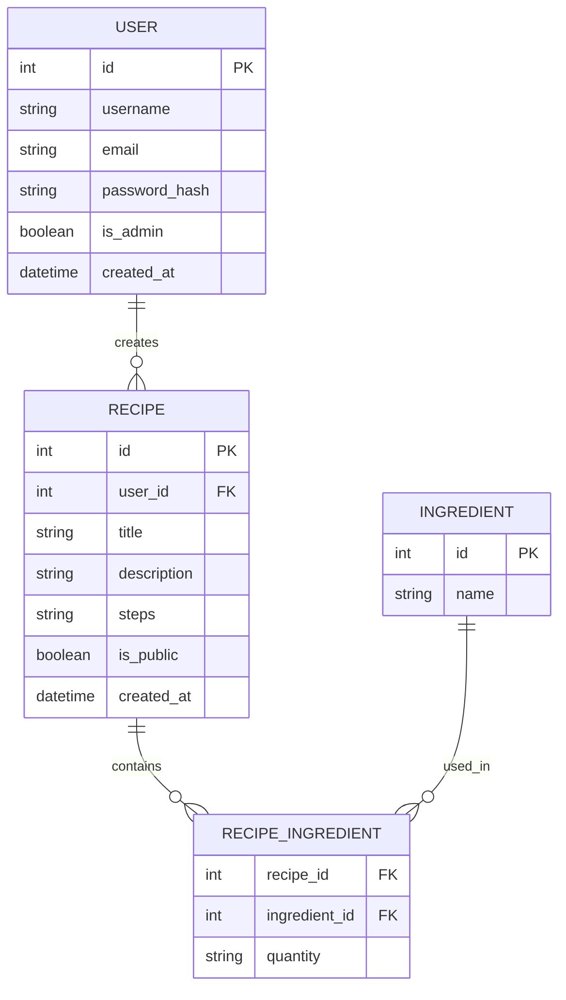

# 資料庫設計文件 (DB Design) - 食譜收藏夾系統

## 1. ER 圖（實體關係圖）

## 2. 資料表詳細說明

### 2.1 users (使用者表)
儲存系統使用者的基本資料與登入資訊。
- `id`: INTEGER PRIMARY KEY AUTOINCREMENT, 唯一識別碼
- `username`: TEXT, 使用者名稱，必填
- `email`: TEXT UNIQUE, 電子郵件，必填
- `password_hash`: TEXT, 雜湊加密後的密碼，必填
- `is_admin`: BOOLEAN, 區分一般用戶與管理員，預設 0
- `created_at`: DATETIME, 註冊時間，預設 CURRENT_TIMESTAMP

### 2.2 recipes (食譜表)
儲存食譜的基本資訊。
- `id`: INTEGER PRIMARY KEY AUTOINCREMENT, 唯一識別碼
- `user_id`: INTEGER, 關聯到建立者的 users.id
- `title`: TEXT, 食譜名稱，必填
- `description`: TEXT, 料理簡介
- `steps`: TEXT, 料理步驟說明，必填
- `is_public`: BOOLEAN, 是否公開，預設 1
- `created_at`: DATETIME, 建立時間，預設 CURRENT_TIMESTAMP

### 2.3 ingredients (食材表)
儲存所有可用的食材名稱。
- `id`: INTEGER PRIMARY KEY AUTOINCREMENT, 唯一識別碼
- `name`: TEXT UNIQUE, 食材名稱，必填

### 2.4 recipe_ingredients (食譜-食材關聯表)
紀錄食譜與多種食材的關聯，以支援組合搜尋。
- `recipe_id`: INTEGER, 關聯到 recipes.id
- `ingredient_id`: INTEGER, 關聯到 ingredients.id
- `quantity`: TEXT, 食材用量 (如：3顆, 100g)，可選填
- PRIMARY KEY (`recipe_id`, `ingredient_id`)
